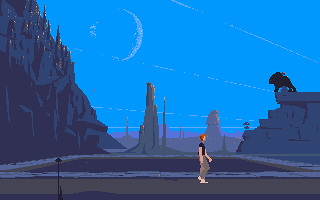

# ANOTHER WORLD INTERPRETER

This is another « Another World » Bytecode Interpreter written in C++ and built with [SDL](https://www.libsdl.org/), targeting Linux, BSD and [WASM](https://en.wikipedia.org/wiki/WebAssembly) with [Emscripten](https://emscripten.org/).

This is a fork of Fabien Sanglard's project, itself a fork of Gregory Montoir's original implementation, almost completely rewritten with a cleaner architecture and better code readability in mind, primarily for educational purposes.



You can play Another World directly in your browser by clicking [here](https://www.emaxilde.net/assets/games/another-world/another-world.html).

## COMPILE AND RUN FOR LINUX

### Install the dependencies

In order to build the Linux port, you must install the build toolchain, the [SDL2](https://www.libsdl.org/) and the [zlib](https://www.zlib.net/) libraries.

Under Debian and derivatives (Ubuntu, Mint, ...):

```
apt-get install build-essential libsdl2-dev zlib1g-dev
```

### Build the project

```
make -f Makefile.linux
```

or

```
./build.sh linux
```

### Install the data files

The original game data files must be copied into the [share/another-world](share/another-world) directory.

### Run the project

```
./bin/another-world.bin
```

## COMPILE AND RUN FOR WASM

### Install the dependencies

In order to build the WASM port, You must install the [Emscripten](https://emscripten.org/) toolchain.

  - [Download and install](https://emscripten.org/docs/getting_started/downloads.html)

### Build the project

```
make -f Makefile.wasm
```

or

```
./build.sh wasm
```

### Install the data files

The original game data files must be copied into the [share/another-world](share/another-world) directory.

### Run the project

```
emrun ./bin/another-world.html
```

## COMMAND-LINE OPTIONS

```
Usage: another-world.bin [OPTIONS...]

Options:

  -h, --help            display this help and exit

  --datadir=PATH        directory where data files are stored
  --dumpdir=PATH        directory where dump files are stored

  --quiet               quiet mode
  --debug               debug mode
  --debug-all           debug all subsystems
  --debug-engine        debug the engine subsystem
  --debug-backend       debug the backend subsystem
  --debug-resources     debug the resources subsystem
  --debug-video         debug the video subsystem
  --debug-audio         debug the audio subsystem
  --debug-mixer         debug the mixer subsystem
  --debug-sound         debug the sound subsystem
  --debug-music         debug the music subsystem
  --debug-input         debug the input subsystem
  --debug-vm            debug the vm subsystem

```

## GAME CONTROLS

  - `Up`, `Down`, `Left`, `Right` move
  - `Space` run or fire
  - `Tab` or `<Shift>Tab` change the window size
  - `0` ... `9` jump at a specific game part
  - `c` enter a code to jump at a specific level
  - `p` pause the game
  - `r` reset the game
  - `m` toggle the display mode (standard/CRT)
  - `v` change the video mode (RGB/RGB-ALT/VGA/EGA/CGA)
  - `Escape` exit the game

## RESOURCES

Eric Chahi's website with some interesting informations:

  - https://www.anotherworld.fr/another_world.htm

Grégory Montoir's reimplementation of the game engine:

  - https://github.com/cyxx/rawgl

Fabien Sanglard's fork cleaned up with legibility and readability in mind:

  - https://github.com/fabiensanglard/Another-World-Bytecode-Interpreter

You can also find below some great articles written by Fabien Sanglard about the architecture and ports of `Another World`:

  - [Another World Code Review](https://fabiensanglard.net/anotherWorld_code_review/)
  - [The polygons of Another World](https://fabiensanglard.net/another_world_polygons/)
  - [The polygons of Another World: Amiga](https://fabiensanglard.net/another_world_polygons_amiga500/)
  - [The polygons of Another World: Atari ST](https://fabiensanglard.net/another_world_polygons_atariST/)
  - [The polygons of Another World: IBM PC](https://fabiensanglard.net/another_world_polygons_PC_DOS/)
  - [The polygons of Another World: Sega Genesis](https://fabiensanglard.net/another_world_polygons_Genesis/)
  - [The polygons of Another World: SNES](https://fabiensanglard.net/another_world_polygons_SNES/)
  - [The polygons of Another World: GBA](https://fabiensanglard.net/another_world_polygons_GBA/)
  - [The polygons of Another World: Jaguar](https://fabiensanglard.net/another_world_polygons_Jaguar/)

## CREDITS

Thanks to:

  - Eric Chahi, obviously, who made this fantastic game and released it in 1991.
  - Gregory Montoir, who reversed the original virtual machine and wrote a full modern implementation.
  - Fabien Sanglard, who improved the reimplementation and wrote blog posts about this clever architecture.

## LICENSE

The source code is released under the terms of the GNU General Public License 2.0.

```
This program is free software: you can redistribute it and/or modify
it under the terms of the GNU General Public License as published by
the Free Software Foundation, either version 2 of the License, or
(at your option) any later version.

This program is distributed in the hope that it will be useful,
but WITHOUT ANY WARRANTY; without even the implied warranty of
MERCHANTABILITY or FITNESS FOR A PARTICULAR PURPOSE.  See the
GNU General Public License for more details.

You should have received a copy of the GNU General Public License
along with this program.  If not, see <http://www.gnu.org/licenses/>
```

## DISCLAIMER

The original game data files are protected under the copyrights of their authors and are not distributed with this project.

```
Please do not distribute the original data game files with this project.
```

